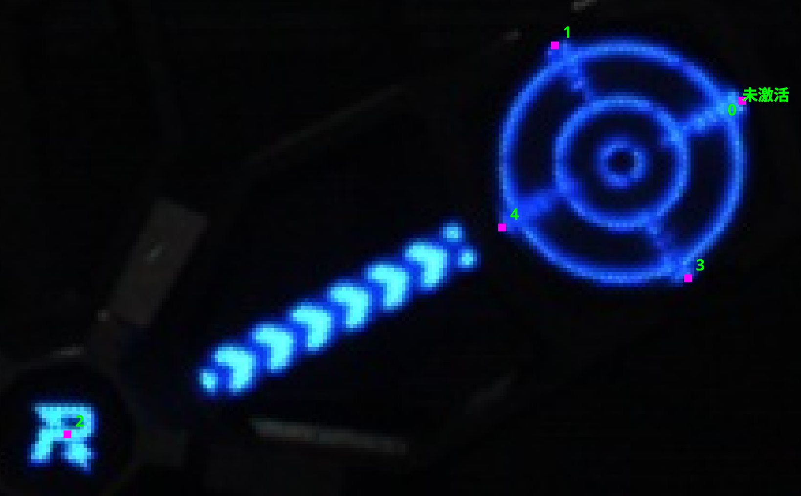
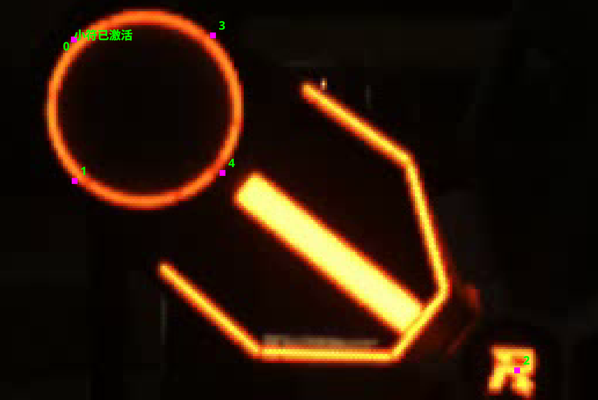
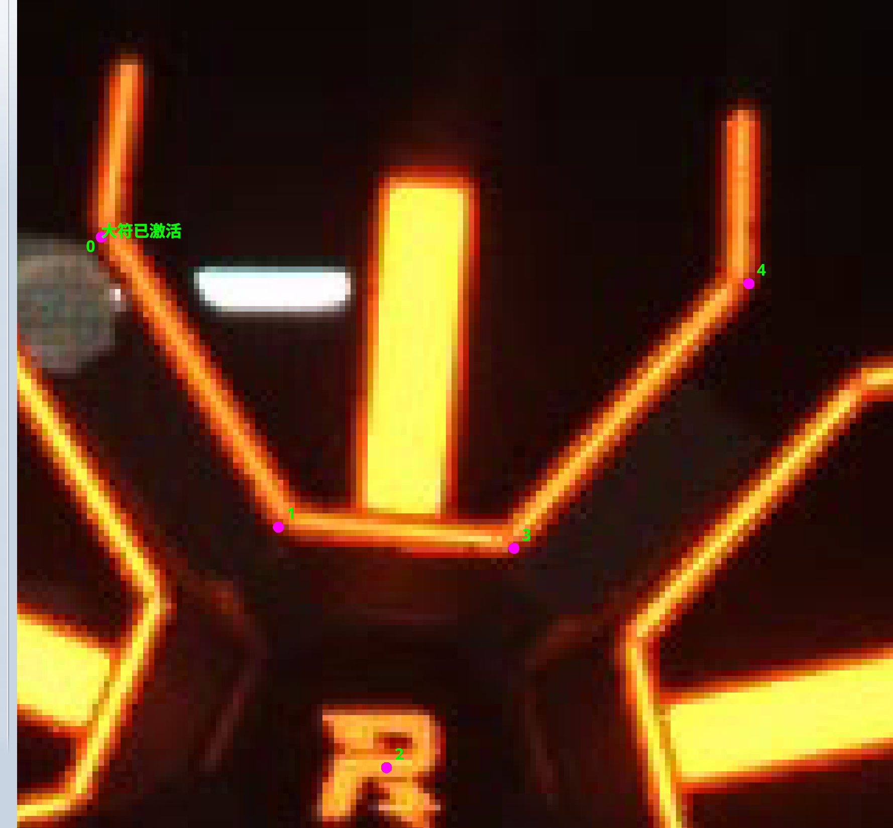
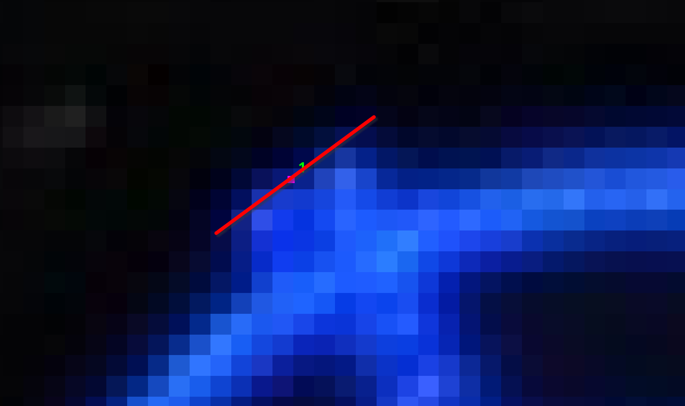
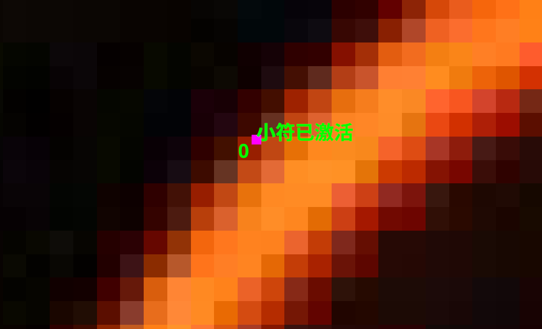
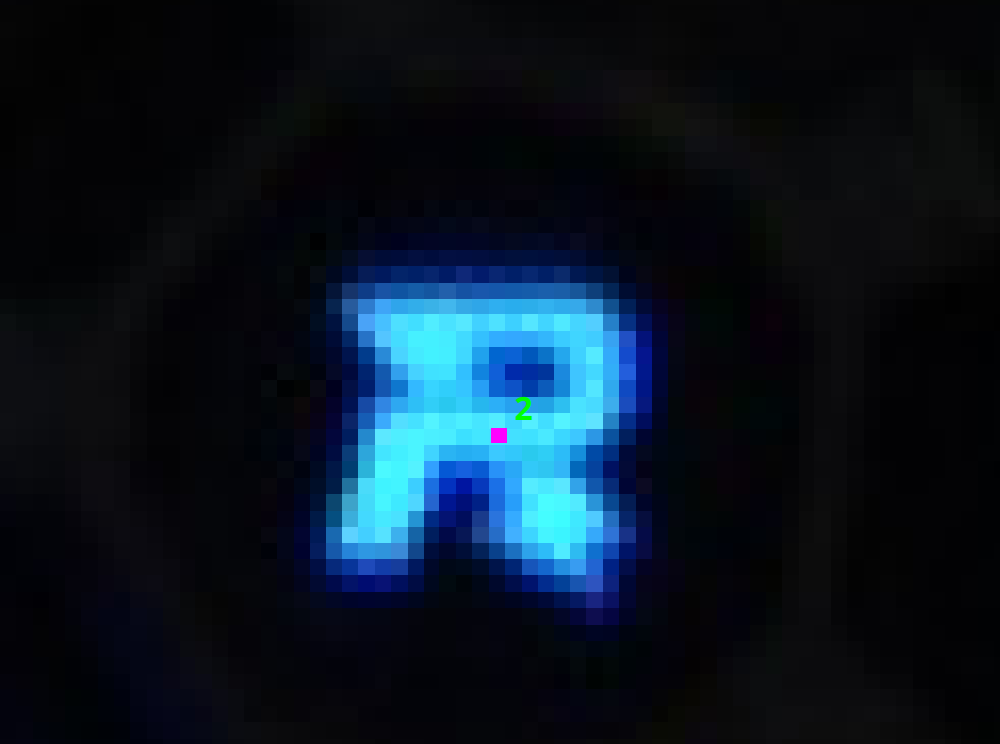
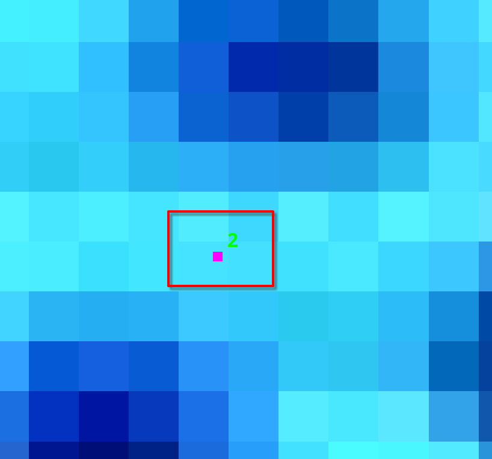

# RoboMaster 能量机关（大/小符）5点检测模型 & OpenVINO C++ 高性能推理库

<div align="center">

[](https://en.cppreference.com/w/cpp/17)
[](https://www.intel.com/content/www/us/en/developer/tools/openvino-toolkit/overview.html)
[](https://opencv.org/)
[](LICENSE)

**专为 RoboMaster 赛事能量机关（大/小符）设计的轻量高效 5 关键点检测模型与 C++ 部署方案**  
*分区赛至全国赛实战验证 · 实车端到端延迟仅 8.5ms · 14k 精选高质量数据集*

</div>

---

## 目录
- [项目背景与方案设计](#项目背景与方案设计)
- [核心特性与实战表现](#核心特性与实战表现)
- [模型输出与关键点定义](#模型输出与关键点定义)
- [数据集与标注规范](#数据集与标注规范)
- [实测性能基准](#实测性能基准)
- [环境配置要求](#环境配置要求)
- [编译与运行指南](#编译与运行指南)
- [命令行参数详解](#命令行参数详解)
- [项目目录结构](#项目目录结构)
- [致谢与开源声明](#致谢与开源声明)

---

## 项目背景与方案设计

在 RoboMaster 比赛中，能量机关（符）的击打距离通常在 **7 米左右**。

- **为什么采用「网络 + 传统视觉」结合方案？**  
  在约 7m 的较远距离下，由于相机分辨率与镜头畸变影响，纯网络端到端预测关键点的像素级微小抖动容易在 PnP 解算后被放大，难以稳定保证超高环数。  
  因此，我们采用了 **深度学习网络初定位与粗关键点提取 + 传统几何与轮廓算法精细解算** 的融合方案：
  1. **深度学习（YOLOv8-Pose）**：负责在大视野与复杂光照干扰下，高鲁棒性地检测能量机关符叶状态（类别分类）并提供 4 个装甲板角点和 1 个 R 标中心的候选区域与初始关键点；
  2. **传统视觉算法**：在网络输出的 ROI 和初值基础上进行亚像素级边缘提取与几何拟合解算，极大保障了远距离打击的稳定性和命中环数。

---

## 核心特性与实战表现

1. **画幅比例匹配与 0 Padding 极速设计**：
   - 相机采集图像原生为 **$1440 \times 1080$**（标准 $4:3$ 宽高比）；
   - 训练数据集与网络模型输入统一采用 **$640 \times 480$**（同为 $4:3$ 宽高比），在预处理 Resize 阶段**完全消除了上下/左右无用的黑边填充（Zero Padding）**；
   - 既保证了有效像素与特征表达的 100% 满幅利用，又消除了冗余计算，大幅降低端到端延迟。
2. **网络架构轻量化优化**：
   - 结构原型基于 **YOLOv8**，使用 **YOLOv8n-pose** 预训练骨干网络；
   - 针对能量机关目标特性进行轻量化剪裁与调优，在保证 5 关键点高稳定度的前提下，极大降低误识别率并显著提升推理速度。
3. **极速实车推理**：
   - 在搭载 **Intel NUC13 (32GB RAM)** 的实车上，利用 **OpenVINO GPU (iGPU)** 加速；
   - 在**完整自瞄主程序全负载运行**的实战工况下，单张图片 **预处理 (Letterbox) + 模型推理 (Infer) + 后处理 (NMS/解码)** 端到端平均耗时仅 **8.5 ms**（> 115 FPS）。
4. **历经全赛程实战检验**：
   - 实战中重点使用了前两类状态（`未激活` 与 `小符已激活`）；
   - 从**分区赛到全国赛**全场次高强度对抗中，前两类状态保持了 **0 误识别、0 丢帧** 的极高稳定性；
   - 注：由于后期打符策略收敛，主要算力与标注精力集中在前两类，第三类（`大符已激活`）未进一步增补数据集，在大符连击部分特殊过渡帧可能存在丢帧现象。

---

## 模型输入输出规格与关键点定义

### 1. 输入尺寸与极致加速设计
- **相机原始输入**：$1440 \times 1080$ 分辨率（标准 $4:3$ 宽高比）；
- **网络推理输入**：$640 \times 480$ 分辨率（同为 $4:3$ 宽高比）；
- **训练数据集规格**：数据集统一采用 $480 \times 640$（高 $480 \times$ 宽 $640$）进行标注与训练；
- **优化优势**：相机图像与网络模型输入保持完全相同的 $4:3$ 宽高比，在预处理 Resize 阶段**完全无需进行上下/左右无效的黑边填充（Zero Padding）**，在提高有效像素利用率的同时消除冗余计算，大幅提高端到端推理速度。

### 2. 输出张量格式与网络结构可视化
- **输出张量维度**：`[1, 18, 6300]`（即 `1 × 18 × 6300`）
  - `1`：Batch Size；
  - `18` 通道：`3` 类别置信度 + `5` 关键点 $\times$ `3` (`x, y, confidence`)；
  - `6300`：多尺度特征图检测 Anchor 候选框总数（$80 \times 60 + 40 \times 30 + 20 \times 15 = 4800 + 1200 + 300 = 6300$）。
- **网络结构可视化**：
  - 可以通过 [Netron 在线模型查看器 (netron.app)](https://netron.app/) 直接打开本仓库中的 `model/model-0624.onnx`，查看完整的网络层级、输入输出张量结构与算子节点细节。

### 3. 类别定义 (Classes)
| Class ID | 类别名称 | 说明 | 实战表现 |
| :---: | :---: | :--- | :--- |
| `0` | **未激活 (inactive)** | 能量机关待击打叶片（大/小符未激活图案一致） | 分区赛至国赛 **0 丢帧、0 误识别** |
| `1` | **小符已激活 (small_activated)** | 小能量机关已被成功击打激活的叶片 | 分区赛至国赛 **0 丢帧、0 误识别** |
| `2` | **大符已激活 (big_activated)** | 大能量机关已被成功击打激活的叶片 | 基础可用（未继续扩增数据，特定场景可能有丢帧） |

### 4. 关键点定义与顺序 (5 Keypoints)


| 未激活状态 (Class 0) | 小符已激活状态 (Class 1) | 大符已激活状态 (Class 2) |
| :---: | :---: | :---: |
| [](./pic/未激活.png) | [](./pic/小符已激活.png) | [](./pic/大符已激活.png) |
| *图 1：未激活五点顺序* | *图 2：小符已激活五点示意* | *图 3：大符已激活五点示意* |

---

## 数据集与标注规范

### 1. 14k 精选高质量数据集
- 本模型基于 **14,000+ (14k)** 张高质量标注样本训练得到；
- 该数据集源于今年 **RobotPilots 战队视觉组** 从 0 标注的 **30,000+ (30k)** 张原始真实赛场采集图像；
- 由网络负责人与视觉组逐张进行严格筛选、清洗与校验，剔除模糊、畸变与异常样本，最终保留 14k 高质量数据；
- 数据集充分覆盖了新赛季能量机关图案特征，且在**高曝光、强逆光、复杂赛场背景**等极端恶劣光照条件下具备出色的泛化能力。

### 2. 关键点标注细则
- **符叶靶子 4 点**：定位在突出边缘的中心位置，统一取**暗部像素与亮部像素的交界处**，保证亚像素级的几何一致性。
- **R 标中心点（第 5 点）**：统一标注在能量机关 R 标的旋转中心。
- **异常过滤规则**：对于严重遮挡（超过 $1/3$ 面积或丢失关键点 $>2$ 个）或非规则手册标准图案，统一归入负样本或清洗剔除。

| 符叶四点边缘标注规范 | 局部放大示意 | R 标标注大图 | R 标标注小图 |
| :---: | :---: | :---: | :---: |
| [](./pic/符叶四点标注.png) | [](./pic/局部放大图.png) | [](./pic/R标大图.png) | [](./pic/R标小图.png) |

---

## 实测性能基准

在实车硬件平台与比赛实战工况下的完整测试数据如下：

- **硬件平台**：Intel NUC13 (Core i7 / i5, 32GB 双通道内存)
- **推理后端**：Intel OpenVINO Runtime (GPU / iGPU 模式)
- **测试环境**：实战全自瞄主程序运行状态（多线程拉流、通信、主状态机等并发运行）
- **输入分辨率**：相机采集 $1440 \times 1080$ $\rightarrow$ 模型输入 $640 \times 480$ (等比例 $4:3$ 缩放，零 Padding)

| 阶段 | 平均耗时 (Mean) | 性能说明 |
| :--- | :---: | :--- |
| **预处理 (Letterbox)** | ~0.5 ms | CPU / OpenCV 图像缩放与填充 |
| **模型推理 (Infer)** | ~7.8 ms | OpenVINO GPU 加速推理 |
| **后处理 (NMS & Decode)** | ~0.2 ms | 关键点坐标映射与距离阈值抑制 |
| **端到端总耗时** | **~8.5 ms** | **单帧全流程耗时 (等效 > 115 FPS)** |

---

## 环境配置要求

### 系统与依赖
- **操作系统**：Ubuntu 20.04 / 22.04 LTS
- **C++ 标准**：C++17 及以上
- **CMake**：>= 3.10
- **OpenCV**：>= 4.5.0
- **Intel OpenVINO Toolkit**：>= 2024.0 (推荐 2024.x 或 2025.x LTS)

### OpenVINO 安装配置 (Ubuntu APT 快速安装)

```bash
# 1. 安装 GPG 密钥与 Intel APT 源
sudo apt update
sudo apt install -y gnupg curl
curl -fsSL https://apt.repos.intel.com/intel-gpg-keys/GPG-PUB-KEY-INTEL-SW-PRODUCTS.PUB | sudo gpg --dearmor -o /usr/share/keyrings/intel-archive-keyring.gpg
echo "deb [signed-by=/usr/share/keyrings/intel-archive-keyring.gpg] https://apt.repos.intel.com/openvino/2025 ubuntu22 main" | sudo tee /etc/apt/sources.list.d/intel-openvino-2025.list

# 2. 安装 OpenVINO Runtime
sudo apt update
sudo apt install -y openvino-2025

# 3. 加载 OpenVINO 环境变量 (可写入 ~/.bashrc 或 ~/.zshrc)
source /opt/intel/openvino_2025/setupvars.sh
```

---

## 编译与运行指南

### 1. 编译项目

```bash
# 克隆仓库
git clone https://github.com/SZURPVision/RuneDetectionModel
cd RuneDetectionModel

# 加载 OpenVINO 环境变量 (若未配置在系统环境中)
source /opt/intel/openvino_2025/setupvars.sh

# 创建构建目录并编译
mkdir build && cd build
cmake ..
make -j$(nproc)
```

编译完成后将在 `build/` 目录下生成可执行文件 `fivepoints_infer`。

---

### 2. 测试脚本使用教程

#### (1) 快速图片/目录批量推理
```bash
# 推理指定目录中的所有图片并保存可视化结果至 output_dir
./build/fivepoints_infer model/model-0624.onnx path/to/images_dir output_dir --device GPU
```

#### (2) 视频流推理与结果保存
```bash
# 对视频进行推理并生成标注视频
./build/fivepoints_infer model/model-0624.onnx video/test_video.avi result_video.avi --device GPU
```

#### (3) 纯基准性能测试模式 (Benchmark / 不落盘)
```bash
# 测试 GPU 吞吐性能与端到端延迟统计 (输出 P50/P90/P99 延迟报告)
./build/fivepoints_infer model/model-0624.onnx video/test_video.avi --device GPU --benchmark
```

#### (4) CPU 模式测试
```bash
# 使用 CPU 进行推理
./build/fivepoints_infer model/model-0624.onnx video/test_video.avi --device CPU --benchmark
```

---

## 命令行参数详解

`fivepoints_infer` 支持丰富的自定义参数：

```text
用法: ./build/fivepoints_infer <model.onnx|model.xml> <input_path> [output_path] [options]

参数选项:
  --device D     推理计算设备 (默认: AUTO, 可选: CPU, GPU, GPU.0 等)
  --warmup N     模型预热次数 (默认: 10)
  --conf T       目标置信度阈值 (默认: 0.8)
  --kconf T      关键点置信度阈值 (默认: 0.8)
  --nms-dist T   NMS 中心点抑制距离阈值 (默认: 30 像素)
  --min-kpts N   每片符叶最少有效关键点个数 (默认: 3)
  --nc N         类别数 (默认从 18 通道自动推断为 3 类别)
  --nk N         关键点数 (默认从 18 通道自动推断为 5 关键点)
  --no-save      不保存渲染图片/视频，加快测试流程
  --benchmark    基准测试模式 (同 --no-save，输出详细统计报表与 CSV)
```

---

## 项目目录结构

```text
rune_open_source/
├── CMakeLists.txt          # CMake 构建工程配置
├── README.md               # 项目文档与使用说明
├── .gitignore              # Git 忽略配置
├── infer/
│   └── fivepoints_infer.cpp # OpenVINO C++ 推理与性能评估测试套件源码
├── model/
│   └── model-0624.onnx     # 训练导出的 ONNX 能量机关 5 点检测模型
├── pic/                    # 标注规范说明图与可视化图例
│   ├── 未激活.png
│   ├── 小符已激活.png
│   ├── 大符已激活.png
│   ├── 符叶四点标注.png
│   ├── 局部放大图.png
│   ├── R标大图.png
│   ├── R标小图.png
│   └── 大符图案.png
└── video/                  # 测试视频目录 (放置实车采集样本)
```

---

## 致谢与开源声明

- 特别感谢 **RobotPilots 战队视觉组全体成员** 在数据集从 0 到 30k 标注工作中的付出与坚守！
- 欢迎各位 RoboMaster 参赛战队与计算机视觉爱好者交流讨论、提出 Issue 或 PR。
- 本项目遵循 **MIT 开源协议**。
